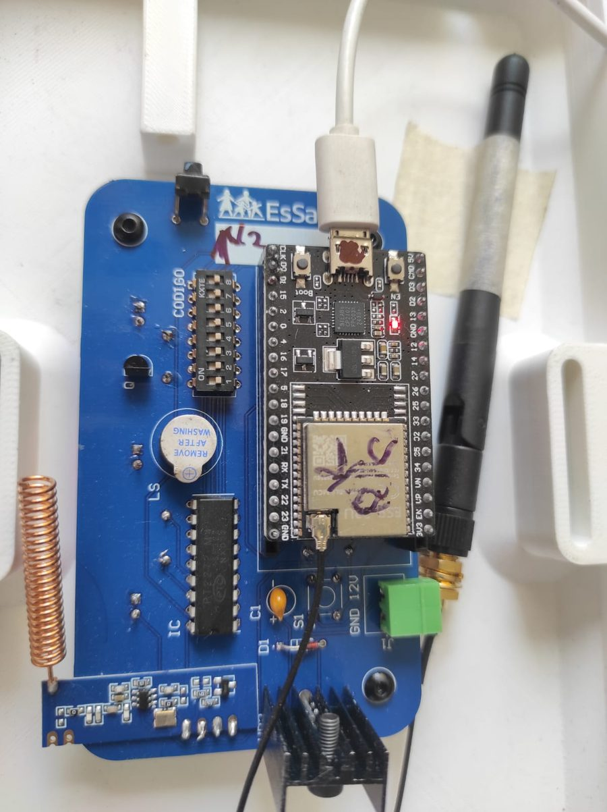
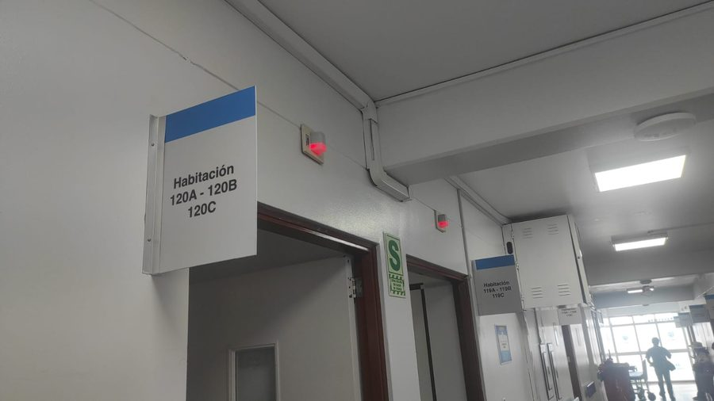
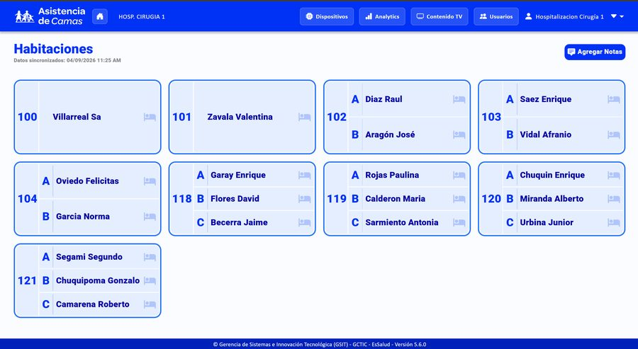
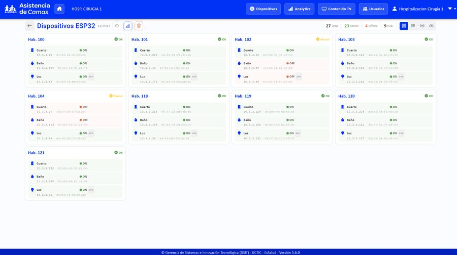
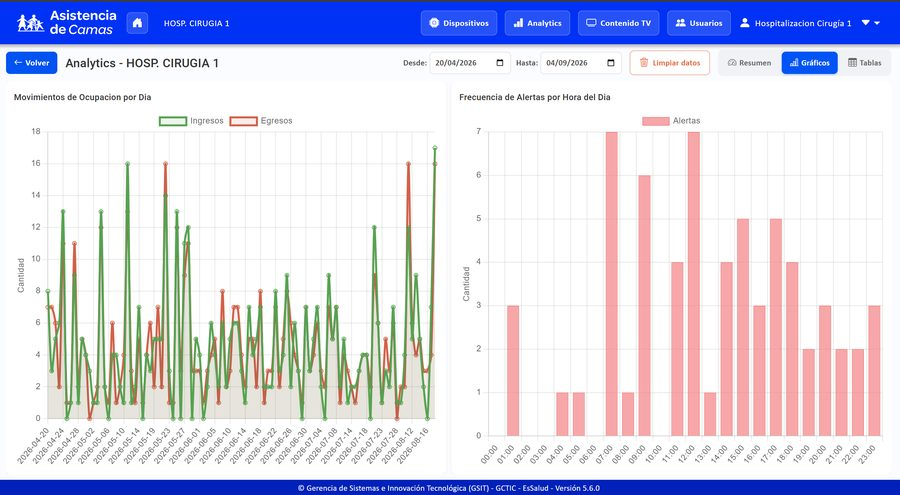

# Sistema de llamado de enfermeras

Un pulsador junto a cada cama de hospital. Cuando el paciente lo aprieta, se
enciende una luz en el pasillo, aparece una entrada en el panel de la estación de
enfermería con la cama y el paciente, y **queda un registro con hora de llamada y
hora de atención**.

Eso último es lo que lo separa de un timbre: el tiempo de respuesta se puede medir.

Desplegado como piloto en un hospital de EsSalud (Perú), en un servicio de
hospitalización de cirugía. El proyecto nació de una necesidad documentada: varios
servicios de la red llevaban años pidiendo timbres sin que llegaran —
[por qué hacía falta](docs/por-que-hacia-falta.md).



---

## La decisión que define el sistema

Un pulsador de emergencia que depende del WiFi del hospital no es un pulsador de
emergencia.

Por eso el enlace entre el botón de la cama y el ESP32 de la habitación **no usa
WiFi ni router**: usa **ESP-NOW**, el protocolo de radio directo de Espressif. La
llamada del paciente llega aunque la red esté caída.

El WiFi aparece después, en el salto del ESP32 al servidor vía MQTT. Ahí ya no es
la llamada crítica, es comunicación de sistema — y si ese tramo falla, la luz del
pasillo ya se encendió igual.

```
   CAMA                    PASILLO                  SERVIDOR              ESTACIÓN
   ────                    ───────                  ────────              ────────

  Pulsador                 ESP32 de la             Node.js               Panel web
  del paciente ──ESP-NOW──▶ habitación  ──MQTT──▶  + PostgreSQL  ──HTTP──▶ (Angular)
                            + luz                                          en tablet
                            + relay
```


*Los indicadores, instalados sobre cada puerta.*



*El mismo pasillo con una llamada activa.*

---

## Stack

| Capa | Tecnología |
|---|---|
| Dispositivo | ESP32 · C++ / Arduino · ESP-NOW · MQTT · LittleFS · PCB propia |
| Servidor | Node.js · Express · MQTT · cron |
| Datos | PostgreSQL — lógica de negocio en funciones almacenadas |
| Panel | Angular 17 · Material |
| Despliegue | Docker Compose · actualización de firmware por OTA |

---

## El sistema en uso



*El mapa de camas: lo que ve el personal en la estación de enfermería. Los datos de la captura son de prueba.*



*Los 27 dispositivos y su estado. Cada uno reporta solo; los que aparecen fuera de línea se detectan sin que nadie llame para avisar.*



*Frecuencia de alertas por hora del día. Es lo que un timbre no puede dar: saber cuándo se concentra la demanda.*

---

## Qué hay en este repositorio

El sistema completo y ejecutable: firmware, backend, panel, base de datos y el
`docker-compose` que lo levanta.

```
firmware/       un solo firmware para los 3 tipos de dispositivo (cuarto, baño, luz)
backend/        Node.js + Express, por modulos. Logica en src/function/*.sql
frontend/       Angular 17 + Material
database/       migraciones numeradas y migrate.sh
mosquitto/      broker MQTT
docs/           arquitectura y la evidencia que sustento el piloto
docker-compose.yml · Makefile · .env.example
```

### Levantarlo

```bash
cp .env.example .env      # y ajusta los valores
docker compose up -d      # postgres, migraciones, mosquitto, backend y panel
```

El servicio `db-migrate` aplica las migraciones en orden antes de que arranque el
backend, así que la base queda lista sin pasos manuales.

Para el firmware: se abre en el IDE de Arduino con el core de ESP32. Al arrancar sin
configurar, el dispositivo levanta su propio punto de acceso y se configura desde el
navegador de un teléfono — ver [firmware/README.md](firmware/README.md).

**Lo que no está aquí:** los datos. Ni el volcado de pacientes, ni los CSV de censo,
ni las credenciales. El esquema y las migraciones sí, así que la base se construye
vacía y funcional.

---

## Decisiones que tomé, y por qué

**La lógica de negocio vive en PostgreSQL, no en Node.** Las funciones almacenadas
hacen el trabajo y el backend las llama. El hospital ya tiene DBAs y la lógica queda
junto a los datos. Es una decisión discutible y conviene saberla antes de buscar las
reglas en el código JavaScript y no encontrarlas.

**Los dispositivos reportan su estado solos.** Cada ESP32 manda un *heartbeat*
periódico con número de serie, MAC, IP, estado del relay, tiempo encendido y
potencia de señal. El panel sabe qué dispositivos están vivos sin esperar a que
alguien reporte una falla — que en un hospital es siempre tarde.

**El sistema no es dueño de los datos del paciente.** Los lee del sistema
hospitalario cada 30 minutos. Si esa API no responde, el sistema sigue avisando de
llamadas con la última foto conocida de quién ocupa cada cama.

**Actualización por aire.** El firmware se versiona junto al backend y se actualiza
por OTA. Con dispositivos repartidos por varias habitaciones, ir cama por cama con
un cable no es opción.

---

## Resultados medidos

Piloto en 9 habitaciones de un servicio de hospitalización de cirugía, del 20/02 al
24/07/2026. Las cifras salen de una exportación completa de la base de datos, no de
estimaciones.

| | |
|---|---|
| Llamados registrados | **256** |
| Mediana de respuesta | **9.7 s** · 74 % en menos de 1 minuto |
| Pacientes cubiertos | **441** · 2,239 paciente-días con timbre disponible |
| Llamados desde el baño | **102 (40 %)**, mediana **7.5 s** |
| Coste de materiales | **≈ S/ 163 por habitación** |
| Dispositivos instalados | **32 ESP32** · 67 reemplazos gestionados desde el sistema |

**El 40 % de los llamados salió del baño.** Es el dato que más cambia una decisión:
el baño es donde ocurren las caídas y es justo donde el timbre de cabecera no llega.

**De día se responde entre 20 y 40 veces más rápido que de noche.** Eso no es una
función que alguien pidiera; es información de gestión que aparece sola cuando cada
llamada queda registrada.

Con una salvedad que conviene leer: la cifra global está muy influida por febrero y
marzo, los meses de instalación y acompañamiento. El mes más representativo de
operación normal es abril — 47 llamados, mediana de 22.7 s, 64 % en menos de un
minuto. Es la cifra que yo defendería.

---

## Limitaciones conocidas

Prefiero decirlas a que se descubran:

- **El panel consulta por intervalos**, no recibe notificaciones push. Una alerta
  tarda hasta un ciclo en aparecer. El backend ya usa MQTT, así que migrar a
  WebSocket o SSE es la mitad del camino — es la mejora pendiente más clara.
- **La ventana de 30 minutos de sincronización es real.** Un paciente que ingresó
  hace diez minutos todavía no aparece con su nombre. Para un sistema de llamado es
  aceptable, pero es una limitación, no un detalle.
- **El promedio que muestra el panel no sirve.** La medición por llamado es buena,
  pero el agregado incluye alertas que nadie canceló —seis quedaron abiertas entre 7
  y 21 días— y eso arrastra la media a valores de horas. La mediana es la métrica
  correcta aquí, y el panel muestra la media.
- **La respuesta se degradó al retirarse el acompañamiento.** Mediana de 7.4 s
  durante la instalación, 60 s en operación. Puede ser que el personal atienda y no
  cancele, un cambio de configuración en mayo, o que la respuesta empeorara de
  verdad. No está confirmado cuál, y hasta confirmarlo no se afirma ninguna.
- **Sin llamados desde el 24/07/2026.** Los dispositivos siguen vivos, así que no es
  falla de hardware: apunta a desuso o a un cambio de servidor. Es el argumento
  central para administrarlo de forma centralizada.
- **La red hospitalaria está aislada**, así que el despliegue lleva las imágenes de
  Docker en archivo en lugar de descargarlas. Funciona, pero hace cada actualización
  un procedimiento manual.

---

## Mi rol

Diseño del sistema completo: electrónica y PCB, firmware, backend, base de datos,
panel e integración con el sistema hospitalario. También el despliegue en sitio y la
capacitación al personal de enfermería.

---

## Sobre los datos

Este repositorio **no contiene datos de pacientes**. Las imágenes fueron revisadas
una a una y se descartaron todas las que mostraban nombres, números de documento o
historias clínicas, además de las que incluían personal identificable. Las capturas
de la interfaz que se añadan más adelante se generan con datos sintéticos.

---

## Licencia

MIT — ver [LICENSE](LICENSE).

La licencia cubre el código publicado aquí. El sistema desplegado y sus datos son
propiedad de la institución para la que se desarrolló.
